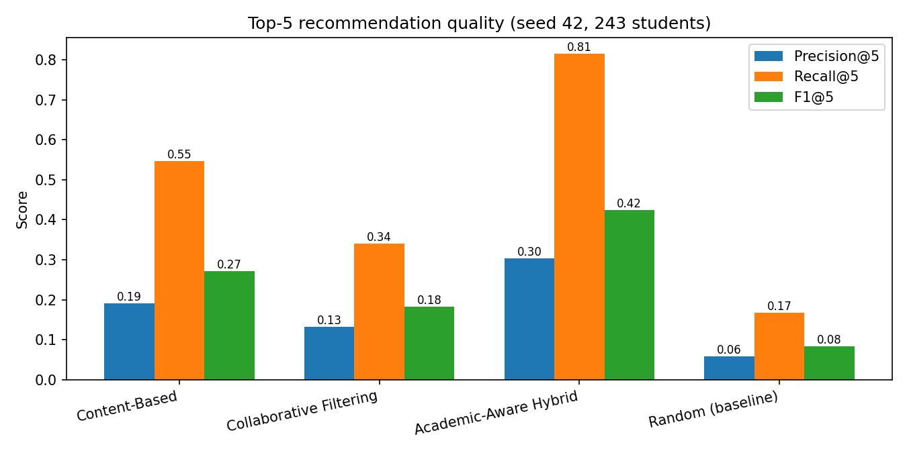
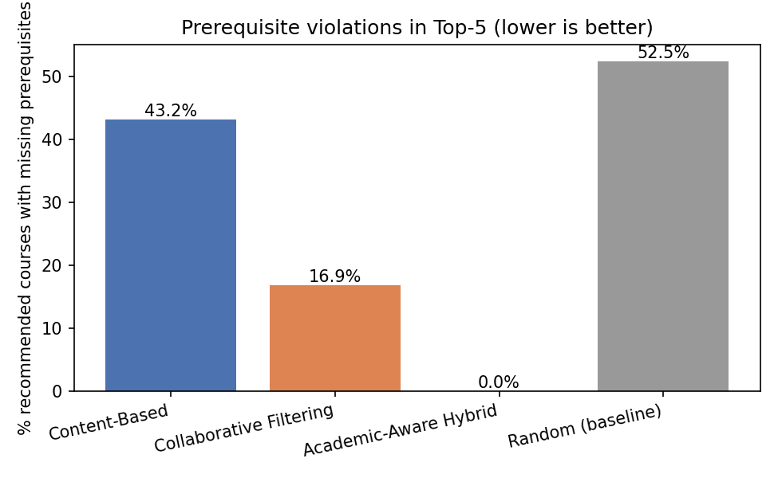

# 🎓 Personalized Course Recommendation System

An AI Lab project that recommends the **top 5 university courses** for a student and compares three approaches:

1. **Content-Based Filtering** – TF-IDF + cosine similarity
2. **Collaborative Filtering** – item-based, "students who liked X also took Y"
3. **Academic-Aware Hybrid (our improvement)** – combines both and adds **prerequisites, semester and difficulty fit**

Includes real experiment results (Precision/Recall/F1@5) and a **Streamlit web app**.

> ⚠️ **The dataset is synthetic** (generated by `generate_dataset.py`). No real student data is used.

---

## 🚀 Quick start (3 commands)

```bash
git clone https://github.com/ailabproject77-boop/course-recommender.git
cd course-recommender
pip install -r requirements.txt
streamlit run app.py
```

Then open **http://localhost:8501**. To re-run training and experiments:

```bash
python train.py       # fits models, tunes hybrid weights on a validation set, saves models/
python evaluate.py    # final test results, ablation, charts
```

Requires Python 3.9+. Optional: create a virtual environment first
(`python -m venv venv`, then `source venv/bin/activate` or `venv\Scripts\activate` on Windows).

---

## 🖥️ Using the demo

1. In the sidebar, click **"Load a sample student"** (e.g. `S010`) or fill in your own interests, skills, completed courses, semester and preferred difficulty.
2. Pick an approach: **Hybrid**, **Content-Based**, **Collaborative Filtering** or **Compare all three**.
3. Read the Top-5 table: score, prerequisite status (✅ / ❌) and a plain-English **reason** for each course.
4. The **Experiment results** tab shows all tables and charts.

---

## 📊 Results

Measured by `evaluate.py` on the synthetic dataset (temporal hold-out, 243 students, K = 5):

| Model | Precision@5 | Recall@5 | F1@5 | Prereq violation rate |
|---|---|---|---|---|
| Content-Based | 0.191 | 0.547 | 0.271 | 43.2% |
| Collaborative Filtering | 0.132 | 0.341 | 0.183 | 16.9% |
| **Academic-Aware Hybrid** (tuned weights) | **0.304** | **0.815** | **0.425** | **0.0%** |
| Random (baseline) | 0.058 | 0.167 | 0.083 | 52.5% |

With our original hand-picked weights the hybrid scored F1 = 0.402; tuning on a validation set raised it to 0.425 on the untouched test set.





More: ablation study (`results/ablation.png`), robustness over 5 other random datasets (`results/multi_seed.csv`), and
precision by semester (`results/precision_by_semester.png`). Full tables: [`results/results.md`](results/results.md).

---

## 🧠 How it works

| Approach | Idea | Score |
|---|---|---|
| Content-Based | Course text → TF-IDF vectors; student profile from interests, skills and liked courses | cosine similarity |
| Collaborative | Student × course rating matrix → course-to-course similarity | Σ similarity × how much the student liked each course |
| **Hybrid (ours)** | Mix of both + academic rules | `0.30·CB + 0.20·CF + 0.25·semester fit + 0.25·difficulty fit` (weights tuned by `train.py`), and courses with unmet prerequisites are removed |

**Evaluation (no data leakage):** courses taken *before* a student's current semester are the training history.
Courses they took *in* that semester and rated ≥ 4 are the hidden test set.

---

## 🏋️ Training (`python train.py`)

Content-Based and item-based Collaborative Filtering are classical methods, so "training" means **fitting** them on data
(no epochs or loss curves). `train.py` does three things and prints a log (`results/training_log.txt`):

1. **Fit** TF-IDF (vocabulary of 344 terms) and the student × course rating matrix + 48×48 course similarity matrix.
2. **Tune** the four hybrid weights by grid search (1,771 combinations) on a **validation set**
   (each student's last training semester). Best: content 0.30, collab 0.20, semester 0.25, difficulty 0.25
   (validation F1 0.447 vs 0.422 for our hand-picked weights).
3. **Save** trained artifacts to `models/` and the weights to `results/best_weights.json`.

The **test set is never used for tuning** – it is scored once at the end. Chart: `results/tuning_chart.png`.

---

## 📁 Project structure

```
├── app.py                 # Streamlit demo
├── generate_dataset.py    # synthetic courses / students / ratings
├── recommenders.py        # the three approaches (+ random baseline)
├── train.py               # fits models + tunes hybrid weights (validation set)
├── evaluate.py            # metrics, ablation, charts
├── data/                  # courses.csv, students.csv, ratings.csv
├── models/                # saved trained models (.joblib)
├── results/               # tables and charts
├── REPORT_AND_VIVA.md     # report content, PPT outline, viva Q&A
└── requirements.txt
```

---

## ⚠️ Limitations

- Synthetic data whose generator follows the same academic rules the hybrid uses, so real-world gains are likely smaller.
- Each student has ~1.86 relevant courses on average, so the maximum possible Precision@5 is about 0.37.
- Weights are tuned on synthetic validation data; the gain (F1 0.402 → 0.425) may not carry over to real data.
- Collaborative filtering suffers from cold start on advanced courses. Several top-10 weight combinations give CF a weight of 0.00–0.10
  with almost identical validation F1, so on this synthetic data CF adds little and the top weight sets are practically tied.
  The tuning gain comes mainly from giving more weight to semester and difficulty fit.

---

## 👥 Team

| Name | Role |
|---|---|
| _Student 1_ | Dataset generation |
| _Student 2_ | Content-Based filtering |
| _Student 3_ | Collaborative filtering |
| _Student 4_ | Hybrid model and evaluation |
| _Student 5_ | Streamlit app and documentation |

Course: AI Lab · Guide: _Teacher name_ · _University, Year_

## 📄 License

MIT – see [LICENSE](LICENSE).
