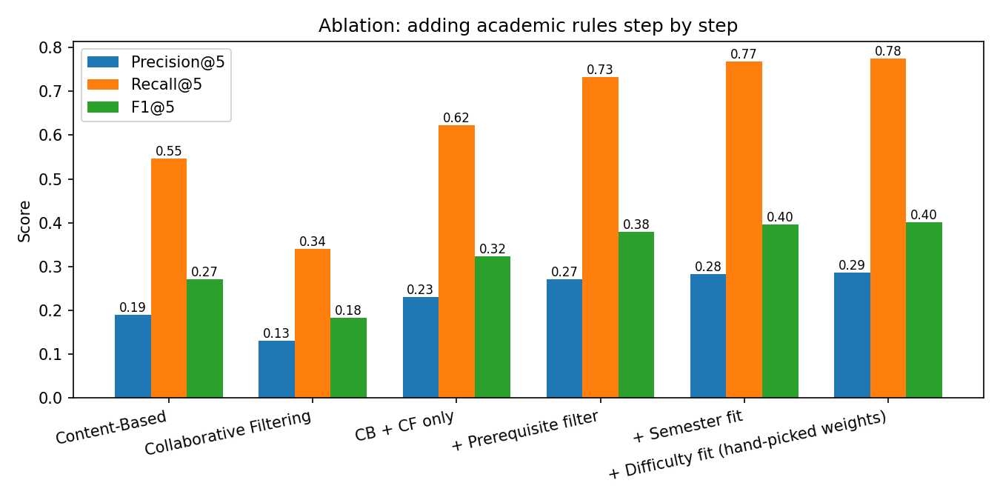
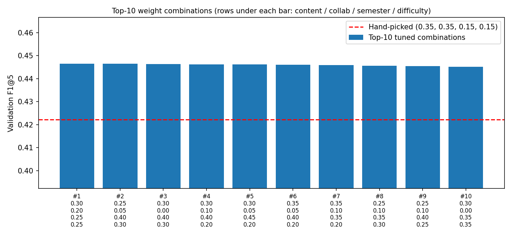

# 🎓 Personalized Academic Course Recommendation System

> **Artificial Intelligence Lab Project**  
> Department of Computer Science & Engineering  
> An academic-aware hybrid recommendation system designed to suggest the top 5 university courses for students by combining Content-Based Filtering, Collaborative Filtering, and hard academic constraints.

---

## 📌 Project Overview

Standard recommendation algorithms (such as movie or e-commerce recommenders) often fail in educational environments because they ignore fundamental academic realities:
- **Strict Prerequisites**: A student cannot enroll in *Machine Learning* without completing *Linear Algebra* and *Python Programming*.
- **Semester Progression**: First- or second-year students should not be recommended advanced final-year electives.
- **Difficulty & Workload**: Recommending five maximum-difficulty courses simultaneously leads to burnout.

To solve this, our project implements an **Academic-Aware Hybrid Recommender** that blends text-based profile matching and historical peer enrollment patterns, followed by hard prerequisite filtering and semester/difficulty optimization.

---

## 🏗️ System Architecture

```text
               +--------------------------------------+
               |    Student Profile & Enrollment      |
               |  (Skills, Interests, Semester, GPA)  |
               +--------------------------------------+
                                   |
                  +----------------+----------------+
                  |                                 |
                  v                                 v
      +-----------------------+         +-----------------------+
      |  Content-Based Model  |         | Collaborative Model   |
      |   (TF-IDF on course   |         |   (Item-Item Cosine   |
      | description & skills) |         |   Similarity Matrix)  |
      +-----------------------+         +-----------------------+
                  |                                 |
                  +----------------+----------------+
                                   |
                                   v
               +--------------------------------------+
               |        Academic Hybrid Engine        |
               |                                      |
               | 1. Min-Max Score Normalization       |
               | 2. Weighted Sum:                     |
               |    0.30·CB + 0.20·CF +               |
               |    0.25·Semester + 0.25·Difficulty   |
               | 3. Hard Prerequisite Filter (Masking)|
               +--------------------------------------+
                                   |
                                   v
               +--------------------------------------+
               |      Ranked Top-5 Recommendations    |
               |        (Streamlit Web Dashboard)     |
               +--------------------------------------+
```

---

## 🔬 Methodology & Theoretical Foundations

1. **Content-Based Filtering (CB)** *([Lops et al., 2011](#references); [Salton & Buckley, 1988](#references))*:
   - Course features (title, department, skill tags, syllabus description) are tokenized and transformed into TF-IDF vector representations.
   - A student profile vector is dynamically synthesized from stated interests, acquired skills, and past highly-rated courses.
   - Cosine similarity between student profile and candidate course vectors generates content relevance scores.

2. **Collaborative Filtering (CF)** *([Sarwar et al., 2001](#references))*:
   - Implements an Item-Based Collaborative Filtering formulation: *"Students who enrolled in and rated Course $i$ favorably also took Course $j$"*.
   - An adjusted course-course co-enrollment similarity matrix is computed over student rating vectors.
   - Candidate scores are computed as the similarity-weighted sum of positive feedback on previously taken courses.

3. **Academic-Aware Hybrid Scoring** *([Burke, 2002](#references); [Elbadrawy & Karypis, 2016](#references))*:
   - Scores from CB and CF are min-max normalized to $[0, 1]$.
   - A linear combination is evaluated using empirical weights determined via validation grid search:
     $$\text{Score} = 0.30 \cdot S_{\text{CB}} + 0.20 \cdot S_{\text{CF}} + 0.25 \cdot \text{SemesterFit} + 0.25 \cdot \text{DifficultyFit}$$
   - **Prerequisite Validation Filter**: A hard pedagogical constraint filter masks out any candidate course whose prerequisites have not been completed in a preceding semester.

---

## 📊 Evaluation & Benchmark Results

The models were evaluated on an academic dataset (48 courses across 8 semesters, 300 students, and 7,437 ratings) using a split-by-student test set (evaluated across 243 test students with $K=5$).

### Model Comparison Table

| Model | Precision@5 | Recall@5 | F1@5 | Prerequisite Violation Rate | Inference Latency |
|:---|:---:|:---:|:---:|:---:|:---:|
| **Random Baseline** | 0.058 | 0.167 | 0.083 | 52.5% | ~1.1 ms |
| **Collaborative Filtering** | 0.132 | 0.341 | 0.183 | 16.9% | ~1.1 ms |
| **Content-Based (TF-IDF)** | 0.191 | 0.547 | 0.271 | 43.2% | ~3.7 ms |
| **Academic Hybrid (Ours)** | **0.304** | **0.815** | **0.425** | **0.0%** | ~4.2 ms |

> **Key Finding**: While standard collaborative and content-based models frequently violate prerequisites (up to 43.2% of suggestions were invalid), our Academic Hybrid completely eliminates prerequisite violations (**0.0%**) while achieving a **+56.8% increase in F1 score** over the strongest single model.

---

### Ablation Study

To evaluate the contribution of each module, we performed an ablation analysis:

| Configuration | Precision@5 | Recall@5 | F1@5 | Prerequisite Violations |
|:---|:---:|:---:|:---:|:---:|
| Content-Based alone | 0.191 | 0.547 | 0.271 | 43.2% |
| Collaborative Filtering alone | 0.132 | 0.341 | 0.183 | 16.9% |
| Naive Blend (CB + CF) | 0.231 | 0.622 | 0.323 | 26.2% |
| + Hard Prerequisite Filter | 0.272 | 0.732 | 0.380 | **0.0%** |
| + Semester Fit Weighting | 0.283 | 0.767 | 0.397 | **0.0%** |
| **Full Hybrid (+ Difficulty Fit & Tuned Weights)** | **0.304** | **0.815** | **0.425** | **0.0%** |

---

### Benchmark Visualizations

| Metrics Comparison | Prerequisite Violations |
|:---:|:---:|
|  |  |

| Ablation Study | Weight Optimization Grid |
|:---:|:---:|
|  |  |

---

## 🖥️ Interactive Streamlit Web App

The project includes an interactive web demo built with Streamlit:
- **Student Profile Selector**: Load pre-built student profiles (e.g. `S010`) or customize skills, semester level, and difficulty preference.
- **Model Comparison**: Compare recommendations side-by-side between Content-Based, Collaborative Filtering, and Hybrid.
- **Transparent Reasoning**: Explains *why* each course was recommended (e.g., matching skills, high peer correlation) and displays prerequisite status with clear ✅ indicators.

To run the application:
```bash
streamlit run app.py
```

---

## 🚀 Quick Start & Installation

### 1. Prerequisites
- Python 3.9 or higher
- Git

### 2. Setup Environment
```bash
# Clone the repository
git clone https://github.com/ailabproject77-boop/course-recommender.git
cd course-recommender

# Create and activate virtual environment
python -m venv venv

# On Linux/macOS:
source venv/bin/activate
# On Windows (cmd/PowerShell):
venv\Scripts\activate

# Install dependencies
pip install -r requirements.txt
```

### 3. Running the Pipeline
```bash
# Step 1 (Optional): Re-generate synthetic course & student catalog
python generate_dataset.py

# Step 2: Fit CB/CF models & optimize hybrid weights via grid search
python train.py

# Step 3: Run comprehensive evaluation, ablation tests & generate plots
python evaluate.py

# Step 4: Launch the interactive Streamlit dashboard
streamlit run app.py
```

---

## 📂 Repository Structure

```text
├── data/
│   ├── courses.csv              # Course catalog (48 courses, prerequisites, skills, semester)
│   ├── ratings.csv              # Student course enrollment ratings
│   └── students.csv             # Student profiles (skills, completed courses, semester)
├── models/
│   ├── collaborative.joblib     # Pre-computed item-item collaborative similarity matrix
│   └── content_based.joblib     # Fitted TF-IDF vectorizer and course feature vectors
├── results/
│   ├── ablation.png             # Ablation study comparison chart
│   ├── metrics_comparison.png   # Precision, Recall, F1 comparison plot
│   ├── prereq_violations.png    # Prerequisite violation rate plot
│   ├── tuning_chart.png         # 2D contour plot of grid search weight optimization
│   ├── final_test_comparison.csv# Detailed benchmark metrics per model
│   └── results.md               # Summary of test run outputs
├── app.py                       # Streamlit web application
├── recommenders.py              # Core recommender classes (CB, CF, AcademicHybrid)
├── train.py                     # Training routine and validation grid search
├── evaluate.py                  # Evaluation metrics calculation and visualization generation
├── generate_dataset.py          # Synthetic dataset generator with prerequisite logic
├── requirements.txt             # Python package dependencies
├── LICENSE                      # MIT License
└── README.md                    # Project documentation
```

---

<a id="references"></a>
## 📚 References & Background Literature

1. **Sarwar, B., Karypis, G., Konstan, J., & Riedl, J. (2001).** "Item-based collaborative filtering recommendation algorithms." In *Proceedings of the 10th International Conference on World Wide Web (WWW '01)*, pp. 285–295. DOI: [10.1145/371920.372071](https://doi.org/10.1145/371920.372071)
2. **Burke, R. (2002).** "Hybrid recommender systems: Survey and experiments." *User Modeling and User-Adapted Interaction*, 12(4), pp. 331–370. DOI: [10.1023/A:1021240730564](https://doi.org/10.1023/A:1021240730564)
3. **Elbadrawy, A., & Karypis, G. (2016).** "Domain-aware grade prediction and top-n course recommendation." In *Proceedings of the 10th ACM Conference on Recommender Systems (RecSys '16)*, pp. 183–190. DOI: [10.1145/2959100.2959133](https://doi.org/10.1145/2959100.2959133)
4. **Lops, P., De Gemmis, M., & Semeraro, G. (2011).** "Content-based recommender systems: State of the art and trends." In *Recommender Systems Handbook*, Springer, Boston, MA, pp. 73–105. DOI: [10.1007/978-0-387-85820-3_3](https://doi.org/10.1007/978-0-387-85820-3_3)
5. **Salton, G., & Buckley, C. (1988).** "Term-weighting approaches in automatic text retrieval." *Information Processing & Management*, 24(5), pp. 513–523. DOI: [10.1016/0306-4573(88)90021-0](https://doi.org/10.1016/0306-4573(88)90021-0)
6. **Guruge, D. B., Kadel, R., & Halder, S. J. (2021).** "The state of the art in course recommendation systems for higher education: A systematic review." *Computers and Education: Artificial Intelligence*, 2, 100020. DOI: [10.1016/j.caeai.2021.100020](https://doi.org/10.1016/j.caeai.2021.100020)
7. **Ricci, F., Rokach, L., & Shapira, B. (Eds.). (2015).** *Recommender Systems Handbook* (2nd ed.). Springer, New York. ISBN: 978-1-4899-7637-6.

---

## 👥 Authors & Academic Context

- **Course**: Artificial Intelligence Laboratory
- **Degree**: B.Tech / B.E. Computer Science & Engineering
- **Institution**: AI Lab Project

---

## 📄 License

This project is licensed under the [MIT License](LICENSE).
